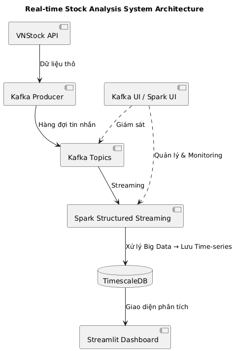

# Vietnam Stock Big Data Pipeline

## Real-time Stock Data Pipeline với Kafka, Spark và TimescaleDB

Pipeline chuyên nghiệp để thu thập, xử lý và phân tích dữ liệu chứng khoán Việt Nam real-time với kiến trúc Big Data hiện đại.

## Kiến Trúc Hệ Thống



```
VNStock API → Kafka Producer → Kafka Topics → Spark Structured Streaming → TimescaleDB → Streamlit Dashboard
     ↓              ↓                ↓                    ↓                    ↓              ↓
Dữ liệu thô → Hàng đợi tin nhắn → Streaming → Xử lý Big Data → Time-series DB → Giao diện phân tích
                                                                         ↓
                                                              Kafka UI / Spark UI
                                                              (Quản lý & Monitoring)
```

### Luồng Dữ Liệu (Data Flow)

Hệ thống hoạt động theo kiến trúc pipeline real-time với các giai đoạn xử lý tuần tự:

#### 1. **Thu Thập Dữ Liệu (Data Ingestion)**
- **VNStock API** → **Kafka Producer**: Producer thu thập dữ liệu thô (raw data) từ VNStock API với tần suất 10 giây/lần cho 200+ mã cổ phiếu.
- **Kafka Producer** → **Kafka Topics**: Producer publish messages vào Kafka topic `realtime_quotes` dưới dạng JSON, tạo hàng đợi tin nhắn (message queue) để xử lý bất đồng bộ.

#### 2. **Xử Lý Dữ Liệu (Data Processing)**
- **Kafka Topics** → **Spark Structured Streaming**: Spark consumer đọc dữ liệu streaming từ Kafka với micro-batching (trigger 15 giây), xử lý và transform dữ liệu.
- **Spark Structured Streaming** → **TimescaleDB**: Spark thực hiện xử lý Big Data (cleaning, validation, aggregation) và lưu trữ vào TimescaleDB dưới dạng time-series data với batch size 10,000 records.

#### 3. **Trực Quan Hóa (Visualization)**
- **TimescaleDB** → **Streamlit Dashboard**: Dashboard truy vấn dữ liệu từ TimescaleDB và hiển thị giao diện phân tích real-time với các biểu đồ candlestick, volume, moving averages.

#### 4. **Giám Sát và Quản Lý (Monitoring & Management)**
- **Kafka UI / Spark UI**: Cung cấp giao diện web để:
  - **Giám sát Kafka**: Theo dõi topics, partitions, consumer lag, message throughput.
  - **Quản lý & Monitoring Spark**: Monitor Spark jobs, stages, tasks, executor resources, streaming query statistics.
  - Truy cập qua Nginx Reverse Proxy với Basic Authentication.

### Các Thành Phần Chính

- **VNStock API**: Thu thập dữ liệu real-time từ thị trường chứng khoán Việt Nam.
- **Apache Kafka**: Message streaming platform cho real-time data ingestion.
- **Apache Spark**: Structured Streaming engine cho big data processing.
- **TimescaleDB**: Time-series database (PostgreSQL extension) tối ưu cho analytics.
- **Streamlit Dashboard**: Real-time dashboard với giao diện SSI-style chuyên nghiệp.
- **Kafka UI**: Web interface để quản lý Kafka topics, partitions, consumer lag.
- **Spark UI**: Giao diện monitor Spark jobs, stages, tasks và cluster resources.
- **Nginx Reverse Proxy**: Unified access point với Basic Authentication cho các UIs.

## Tính Năng Chính

### Real-time Data Collection
- Thu thập dữ liệu từ **200+ mã cổ phiếu** real-time.
- Collection interval: **10 giây**.
- Parallel fetching với **24 workers**.
- Tự động lọc và validate tickers.

### Big Data Processing
- **Spark Structured Streaming** với micro-batching (15 giây).
- Xử lý **50,000+ messages** mỗi trigger.
- **200 shuffle partitions** cho high throughput.
- **10,000 batch size** cho JDBC writes.
- Checkpointing để đảm bảo fault tolerance.

### Time-series Database
- **TimescaleDB** hypertables cho dữ liệu time-series.
- Tối ưu cho queries theo thời gian.
- Compression và retention policies.
- Indexes tối ưu cho performance.

### Professional Dashboard
- **SSI-style** giao diện chuyên nghiệp.
- **Real-time updates** với auto-refresh.
- **Candlestick charts** với MA5, MA20.
- **Volume charts** với màu sắc professional.
- **Phân tích cổ phiếu** chi tiết.
- **Top/Worst performers** tracking.

## Cài Đặt và Triển Khai

### 1. Yêu Cầu Hệ Thống

- **Docker** & **Docker Compose** (v2.0+).
- **RAM**: Tối thiểu 8GB (Khuyến nghị 16GB+).
- **CPU**: Tối thiểu 4 cores (Khuyến nghị 8+ cores).
- **Disk**: Tối thiểu 50GB free space.
- **Network**: Internet connection để truy cập VNStock API.

### 2. Clone Repository

```bash
git clone <repository-url>
cd vietnam-stock-pipeline
```

### 3. Cấu Hình

Tạo file `.env` trong thư mục gốc với các biến môi trường cần thiết:

```bash
POSTGRES_PASSWORD=<your_password>
KAFKA_UI_PASSWORD=<your_password>
```

**Lưu ý**: File `.env` đã được thêm vào `.gitignore` và không được commit vào git.

### 4. Triển Khai Pipeline

```bash
# Khởi động tất cả services
docker-compose -f docker-compose-timescaledb.yml up -d

# Xem trạng thái
docker-compose -f docker-compose-timescaledb.yml ps

# Xem logs
docker-compose -f docker-compose-timescaledb.yml logs -f [service-name]
```

### 5. Truy Cập Services

| Service | URL | Credentials | Mô Tả |
|---------|-----|-------------|-------|
| **Dashboard** | http://localhost:8501 | Không cần | Streamlit dashboard |
| **UI Proxy** | http://localhost:8080 | admin / <password> | Unified access cho Spark UI & Kafka UI |
| **Spark UI** | http://localhost:8080/spark/ | admin / <password> | Monitor Spark jobs |
| **Kafka UI** | http://localhost:8080/kafka/ | admin / <password> | Quản lý Kafka topics |
| **TimescaleDB** | localhost:5433 | stock_app / <password> | Database |
| **Kafka** | localhost:9092 | - | Message broker |

**Lưu ý**: Spark UI và Kafka UI cũng có thể truy cập trực tiếp qua:
- Spark UI: http://127.0.0.1:4041 (chỉ localhost)
- Kafka UI: http://127.0.0.1:8081 (chỉ localhost)

## Services và Ports

| Service | Container Name | Port (External) | Port (Internal) | Status |
|---------|---------------|-----------------|-----------------|--------|
| **TimescaleDB** | vietnam-stock-timescaledb | 5433 | 5432 | Healthy |
| **Zookeeper** | vietnam-stock-zookeeper | - | 2181 | Healthy |
| **Kafka** | vietnam-stock-kafka | 9092, 9093 | 29092 | Healthy |
| **Real Data Producer** | real-data-producer-vn30 | - | - | Running |
| **Spark Consumer** | vietnam-stock-spark-consumer | 4041 | 4040 | Healthy |
| **Dashboard** | vietnam-stock-dashboard | 8501 | 8501 | Healthy |
| **Kafka UI** | vietnam-stock-kafka-ui | 8081 | 8080 | Healthy |
| **UI Proxy** | vietnam-stock-ui-proxy | 8080 | 80 | Running |

## Database Schema

### Bảng Chính: `realtime_quotes`

```sql
CREATE TABLE realtime_quotes (
    time TIMESTAMPTZ NOT NULL,           -- Primary timestamp
    ticker VARCHAR(10) NOT NULL,          -- Stock symbol
    price DECIMAL(15,2),                  -- Current price
    volume BIGINT,                        -- Trading volume
    change DECIMAL(15,2),                 -- Price change
    percent_change DECIMAL(10,4),         -- Percentage change
    high DECIMAL(15,2),                   -- Day high
    low DECIMAL(15,2),                    -- Day low
    open_price DECIMAL(15,2),             -- Open price
    close_price DECIMAL(15,2),            -- Close price
    quote_time VARCHAR(50),               -- Quote timestamp from API
    ingest_time TIMESTAMPTZ,              -- Ingestion timestamp
    data_source VARCHAR(50) DEFAULT 'vnstock'
);

-- Convert to hypertable for time-series optimization
SELECT create_hypertable('realtime_quotes', 'time');
```

### Indexes

- Primary key: `(time, ticker)`.
- Indexes trên `ticker`, `time` cho query performance.
- Tối ưu cho time-range queries.

## Kafka Configuration

### Topic: `realtime_quotes`

- **Partitions**: 12 (scaled for high throughput).
- **Replication Factor**: 1.
- **Retention**: 7 days.
- **Message Format**: JSON.

### Producer Configuration

- **Collection Interval**: 10 giây.
- **Max Workers**: 24 (parallel fetching).
- **Tickers**: 200+ mã cổ phiếu (từ `data/top200_tickers.txt`).
- **Batch Size**: Tự động điều chỉnh.

### Consumer Configuration (Spark)

- **Trigger**: 15 seconds.
- **Max Offsets Per Trigger**: 50,000.
- **Shuffle Partitions**: 200.
- **JDBC Batch Size**: 10,000.
- **JDBC Write Partitions**: 8.

## Dashboard Features

### Trang Chủ - Tổng Quan
- **Tổng Quan Thị Trường**: Số liệu tổng hợp, số lượng mã, tổng khối lượng.
- **Phân Bố Hiệu Suất**: Biểu đồ tăng/giảm/không đổi.
- **Real-time Metrics**: Cập nhật tự động.

### Bảng Giá Real-time
- Tìm kiếm và lọc mã cổ phiếu.
- Sắp xếp theo khối lượng, thay đổi %, giá.
- Hiển thị 50-500 mã.
- Loại bỏ duplicate entries.

### Top Performers
- Top 20 cổ phiếu tăng giá mạnh nhất.
- Biểu đồ và bảng chi tiết.
- Real-time updates.

### Phân Tích Cổ Phiếu
- **Combined Chart**: Candlestick + Volume trên cùng một chart.
- **Moving Averages**: MA5 (cyan) và MA20 (orange).
- **Volume Chart**: Màu sắc professional (cyan #00BCD4).
- **Time Range**: 1 ngày, 7 ngày, 30 ngày.
- **Auto-refresh**: Tùy chọn tự động làm mới sau 10 giây.
- **Thông tin giá hiện tại**: Giá, thay đổi, phần trăm.

## Configuration

### Environment Variables

#### Real Data Producer
```bash
KAFKA_BOOTSTRAP_SERVERS=kafka:29092
COLLECTION_INTERVAL=10          # seconds
MAX_WORKERS=24                  # parallel workers
LOG_LEVEL=INFO
TICKERS_FILE=/app/data/top200_tickers.txt
```

#### Spark Consumer
```bash
KAFKA_BOOTSTRAP_SERVERS=kafka:29092
POSTGRES_URL=jdbc:postgresql://timescaledb:5432/stock_db
POSTGRES_USER=stock_app
POSTGRES_PASSWORD=<password>
SPARK_MASTER=local[*]
MAX_OFFSETS_PER_TRIGGER=50000
SPARK_SHUFFLE_PARTITIONS=200
JDBC_BATCH_SIZE=10000
JDBC_WRITE_PARTITIONS=8
STREAM_TRIGGER=15 seconds
```

#### Dashboard
```bash
POSTGRES_HOST=timescaledb
POSTGRES_PORT=5432
POSTGRES_DB=stock_db
POSTGRES_USER=stock_app
POSTGRES_PASSWORD=<password>
```

## Monitoring & Logging

### Log Locations

- `./logs/`: Tất cả application logs
- `./logs/kafka_producer.log`: Producer logs
- `./logs/spark_consumer.log`: Spark consumer logs
- `./logs/dashboard.log`: Dashboard logs

### Health Checks

Tất cả services có health checks:
- **TimescaleDB**: `pg_isready`.
- **Kafka**: Topic listing.
- **Spark Consumer**: Spark UI API check.
- **Dashboard**: Streamlit health endpoint.

### Monitoring Commands

```bash
# Xem logs real-time
docker-compose -f docker-compose-timescaledb.yml logs -f [service-name]

# Xem resource usage
docker stats

# Xem trạng thái services
docker-compose -f docker-compose-timescaledb.yml ps

# Monitor Kafka topics
docker exec vietnam-stock-kafka kafka-topics --bootstrap-server localhost:9092 --list

# Monitor consumer lag
# Qua Kafka UI: http://localhost:8080/kafka/
```

### Key Metrics to Monitor

#### Kafka Metrics
- **Messages per second**: Throughput.
- **Consumer lag**: Độ trễ xử lý.
- **Partition distribution**: Cân bằng tải.
- **Topic size**: Disk usage.

#### Spark Metrics
- **Processing time**: Thời gian xử lý mỗi batch.
- **Throughput**: Records/second.
- **Input rate**: Từ Kafka.
- **Output rate**: Đến TimescaleDB.
- **Shuffle read/write**: I/O performance.

#### Database Metrics
- **Records count**: Tổng số records.
- **Unique tickers**: Số mã cổ phiếu.
- **Data freshness**: Thời gian cập nhật gần nhất.
- **Query performance**: Response time.

## Development

### Project Structure

```
vietnam-stock-pipeline/
├── kafka_producers/              # Data ingestion
│   ├── real_data_producer.py     # Real-time data producer
│   └── __init__.py
├── consumers/                    # Data processing
│   └── spark_structured_streaming_consumer.py
├── dashboard/                    # Streamlit dashboard
│   └── ssi_style_dashboard.py    # SSI-style professional dashboard
├── dockerfiles/                  # Docker configurations
│   ├── Dockerfile.kafka-producer
│   ├── Dockerfile.spark-consumer
│   ├── Dockerfile.dashboard
│   └── Dockerfile.nginx-reverse-proxy
├── scripts/                      # Management scripts
│   └── timescaledb_init.sql      # Database initialization
├── nginx/                        # Nginx configuration
│   └── conf.d/bigdata-ui.conf
├── data/                        # Data files
│   └── top200_tickers.txt        # List of 200 stock tickers
├── logs/                         # Application logs
├── docker-compose-timescaledb.yml # Main orchestration file
├── requirements.txt              # Python dependencies
├── .env                          # Environment variables (not in git)
└── README.md                     # This file
```

### System Design
- Chi tiết kiến trúc, workflows, lý do chọn tech stack, tuning, bảo mật: xem `DOCS/SYSTEM_DESIGN.md`.

### Adding New Features

1. **Thêm ticker mới**: Cập nhật `data/top200_tickers.txt`.
2. **Thay đổi collection interval**: Sửa `COLLECTION_INTERVAL` trong docker-compose.
3. **Tối ưu Spark**: Điều chỉnh `MAX_OFFSETS_PER_TRIGGER`, `SPARK_SHUFFLE_PARTITIONS`.
4. **Thêm dashboard feature**: Cập nhật `dashboard/ssi_style_dashboard.py`.

## Security

### Authentication

- **UI Proxy**: Basic Authentication (admin / <password>).
- **Kafka UI**: Login authentication.
- **Spark UI**: Qua proxy với Basic Auth.
- **Dashboard**: Public (có thể thêm auth nếu cần).

### Network Security

- **Local-only ports**: Spark UI (4041) và Kafka UI (8081) chỉ bind trên 127.0.0.1 .
- **Public ports**: Dashboard (8501), TimescaleDB (5433), Kafka (9092).
- **Internal network**: Docker network riêng cho services.

### Container Security

- Non-root users trong containers.
- Health checks enabled.
- Resource limits (nếu cần).
- Read-only volumes cho data files.

## Troubleshooting

### Common Issues

#### 1. Services không start
```bash
# Kiểm tra logs
docker-compose -f docker-compose-timescaledb.yml logs [service-name]

# Kiểm tra status
docker-compose -f docker-compose-timescaledb.yml ps

# Restart service
docker-compose -f docker-compose-timescaledb.yml restart [service-name]
```

#### 2. Database connection failed
```bash
# Kiểm tra TimescaleDB
docker exec vietnam-stock-timescaledb pg_isready -U stock_app -d stock_db

# Test connection
docker exec vietnam-stock-timescaledb psql -U stock_app -d stock_db -c "SELECT 1;"
```

#### 3. Không có dữ liệu trong dashboard
```bash
# Kiểm tra producer
docker logs real-data-producer-vn30 --tail 50

# Kiểm tra Kafka topics
docker exec vietnam-stock-kafka kafka-console-consumer --bootstrap-server localhost:9092 --topic realtime_quotes --from-beginning --max-messages 10

# Kiểm tra database
docker exec vietnam-stock-timescaledb psql -U stock_app -d stock_db -c "SELECT COUNT(*) FROM realtime_quotes;"
```

#### 4. Spark consumer lag cao
- Tăng `MAX_OFFSETS_PER_TRIGGER`.
- Tăng `SPARK_SHUFFLE_PARTITIONS`.
- Tăng `JDBC_WRITE_PARTITIONS`.
- Kiểm tra resource usage.

### Performance Tuning

#### Kafka
- Tăng số partitions nếu cần.
- Điều chỉnh retention policy.
- Monitor consumer lag.

#### Spark
- Tăng shuffle partitions cho large datasets.
- Điều chỉnh batch size.
- Tối ưu checkpoint location..

#### TimescaleDB
- Compression policies.
- Retention policies.
- Index optimization.

## Support & Resources

### Documentation
- **README.md**: File này
- **DOCS/SYSTEM_DESIGN.md**: Chi tiết kiến trúc và thiết kế hệ thống

### Monitoring URLs
- Dashboard: http://localhost:8501
- UI Proxy: http://localhost:8080
- Spark UI: http://localhost:8080/spark/
- Kafka UI: http://localhost:8080/kafka/

### Useful Commands

```bash
# Xem tất cả logs
docker-compose -f docker-compose-timescaledb.yml logs -f

# Restart tất cả services
docker-compose -f docker-compose-timescaledb.yml restart

# Stop tất cả services
docker-compose -f docker-compose-timescaledb.yml stop

# Start tất cả services
docker-compose -f docker-compose-timescaledb.yml start

# Rebuild images
docker-compose -f docker-compose-timescaledb.yml build --no-cache

# Clean unused resources
docker system prune -f
```

## Roadmap

### Phase 1: Core Pipeline (Completed)
- [x] VNStock API integration.
- [x] Kafka streaming với 200+ tickers.
- [x] Spark Structured Streaming.
- [x] TimescaleDB integration.
- [x] Professional Streamlit dashboard.
- [x] Kafka UI và Spark UI.
- [x] Security với Basic Auth.

### Phase 2: Advanced Features (Planned)
- [ ] Machine learning predictions.
- [ ] Alert system (email/SMS).
- [ ] API endpoints (REST/GraphQL).
- [ ] Advanced analytics queries.
- [ ] Multi-exchange support.

### Phase 3: Enterprise Features (Future)
- [ ] High availability setup.
- [ ] Multi-region deployment.
- [ ] Real-time alerts.
- [ ] Custom indicators.
- [ ] Portfolio management.

## 🤝 Contributing

1. Fork the repository.
2. Create feature branch (`git checkout -b feature/AmazingFeature`).
3. Commit changes (`git commit -m 'Add some AmazingFeature'`).
4. Push to branch (`git push origin feature/AmazingFeature`).
5. Open Pull Request.

---

**Vietnam Stock Big Data Pipeline - Powered by Kafka + Spark + TimescaleDB + Streamlit**
