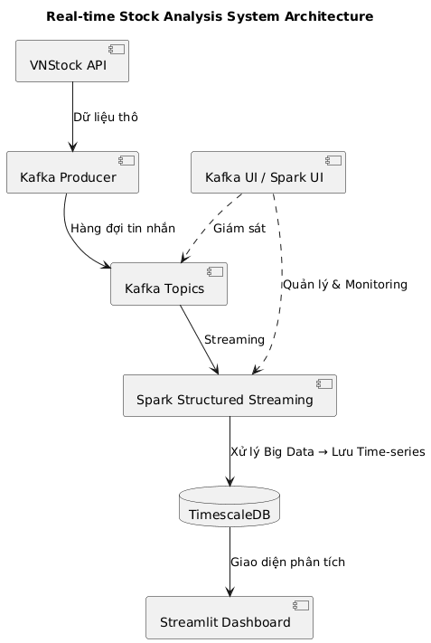

# Vietnam Stock Big Data Pipeline

## Real-time Stock Data Pipeline với Kafka, Spark, TimescaleDB và Snowflake DWH

Pipeline chuyên nghiệp để thu thập, xử lý và phân tích dữ liệu chứng khoán Việt Nam real-time với kiến trúc Big Data hiện đại.

## Kiến Trúc Hệ Thống



```
VNStock API → Kafka Producer → Kafka Topics → Spark Structured Streaming → TimescaleDB (Staging)
     ↓              ↓                ↓                    ↓                         ↓
Dữ liệu thô → Hàng đợi tin nhắn → Streaming → Xử lý Big Data → Lưu dữ liệu gần real-time
                                                                                   ↓
                                                                      Snowflake Sync (Incremental)
                                                                                   ↓
                                                                   Snowflake DWH (BRONZE/SILVER/DW)
                                                                                   ↓
                                                                   Streamlit Realtime + BI Dashboard
```

### Luồng Dữ Liệu (Data Flow)

Hệ thống hoạt động theo kiến trúc pipeline real-time với các giai đoạn xử lý tuần tự:

#### 1. **Thu Thập Dữ Liệu (Data Ingestion)**
- **VNStock API** → **Kafka Producer**: Producer thu thập dữ liệu thô (raw data) từ VNStock API với tần suất 10 giây/lần cho 200+ mã cổ phiếu.
- **Kafka Producer** → **Kafka Topics**: Producer publish messages vào Kafka topic `realtime_quotes` dưới dạng JSON, tạo hàng đợi tin nhắn (message queue) để xử lý bất đồng bộ.

#### 2. **Xử Lý Dữ Liệu (Data Processing)**
- **Kafka Topics** → **Spark Structured Streaming**: Spark consumer đọc dữ liệu streaming từ Kafka với micro-batching (trigger 15 giây), xử lý và transform dữ liệu.
- **Spark Structured Streaming** → **TimescaleDB**: Spark thực hiện xử lý Big Data (cleaning, validation, aggregation) và lưu trữ vào TimescaleDB dưới dạng time-series data với batch size 10,000 records.

#### 3. **Data Warehouse (Snowflake)**
- **TimescaleDB** → **Snowflake**: Service `snowflake-sync` đồng bộ incremental theo watermark.
- **Snowflake DWH**: Mô hình `BRONZE -> SILVER -> DW (DIM/FACT)` phục vụ BI/analytics.

#### 4. **Trực Quan Hóa (Visualization)**
- **Snowflake DWH / TimescaleDB** → **Streamlit Dashboard**: Dashboard tách 2 khu vực `Realtime Dashboard` và `BI Dashboard`.

#### 5. **Giám Sát và Quản Lý (Monitoring & Management)**
- **Kafka UI / Spark UI**: Cung cấp giao diện web để:
  - **Giám sát Kafka**: Theo dõi topics, partitions, consumer lag, message throughput.
  - **Quản lý & Monitoring Spark**: Monitor Spark jobs, stages, tasks, executor resources, streaming query statistics.
  - Truy cập qua Nginx Reverse Proxy với Basic Authentication.

### Các Thành Phần Chính

- **VNStock API**: Thu thập dữ liệu real-time từ thị trường chứng khoán Việt Nam.
- **Apache Kafka**: Message streaming platform cho real-time data ingestion.
- **Apache Spark**: Structured Streaming engine cho big data processing.
- **TimescaleDB**: Time-series staging database.
- **Snowflake**: Data warehouse chính cho mô hình dim/fact.
- **Streamlit Dashboard**: Realtime + BI dashboard theo phong cách SSI/PowerBI.
- **Kafka UI**: Web interface để quản lý Kafka topics, partitions, consumer lag.
- **Spark UI**: Giao diện monitor Spark jobs, stages, tasks và cluster resources.
- **Nginx Reverse Proxy**: Unified access point với Basic Authentication cho các UIs.

## Tính Năng Chính

### Real-time Data Collection
- Thu thập dữ liệu từ **200+ mã cổ phiếu** real-time.
- Collection interval: **10 giây**.
- Parallel fetching với **24 workers**.
- Tự động lọc và validate tickers.

### Big Data Processing
- **Spark Structured Streaming** với micro-batching (15 giây).
- Xử lý **50,000+ messages** mỗi trigger.
- **200 shuffle partitions** cho high throughput.
- **10,000 batch size** cho JDBC writes.
- Checkpointing để đảm bảo fault tolerance.

### Time-series Database
- **TimescaleDB** hypertables cho dữ liệu time-series.
- Tối ưu cho queries theo thời gian.
- Compression và retention policies.
- Indexes tối ưu cho performance.

### Dashboard
- **Realtime Dashboard + BI Dashboard** tách khu vực rõ ràng.
- **Global BI filters**: Top N, volume tối thiểu, ticker focus.
- **Pipeline Health/Data Quality panel** trong BI tab.
- **Giờ Việt Nam (Asia/Ho_Chi_Minh)** cho toàn bộ timestamp hiển thị.
- **Market-hour aware status**: ngoài giờ giao dịch hiển thị `Ngoài giờ giao dịch`.
- **Responsive mobile**: KPI/cards/buttons tối ưu cho điện thoại.
- **SSI-style** giao diện chuyên nghiệp.
- **Real-time updates** với auto-refresh.
- **Candlestick charts** với MA5, MA20.
- **Volume charts** với màu sắc nhất quán.
- **Phân tích cổ phiếu** chi tiết.
- **Top/Worst performers** tracking.

## Cài Đặt và Triển Khai

### 1. Yêu Cầu Hệ Thống

- **Docker** & **Docker Compose** (v2.0+).
- **RAM**: Tối thiểu 8GB (Khuyến nghị 16GB+).
- **CPU**: Tối thiểu 4 cores (Khuyến nghị 8+ cores).
- **Disk**: Tối thiểu 50GB free space.
- **Network**: Internet connection để truy cập VNStock API.

### 2. Clone Repository

```bash
git clone <repository-url>
cd vietnam-stock-pipeline
```

### 3. Cấu Hình

Tạo file `.env` trong thư mục gốc với các biến môi trường cần thiết:

```bash
POSTGRES_PASSWORD=<your_password>
KAFKA_UI_PASSWORD=<your_password>
```

**Lưu ý**: File `.env` đã được thêm vào `.gitignore` và không được commit vào git.

### 4. Triển Khai Pipeline

```bash
# Khởi động tất cả services
docker compose -f docker-compose-timescaledb.yml up -d

# Xem trạng thái
docker compose -f docker-compose-timescaledb.yml ps

# Xem logs
docker compose -f docker-compose-timescaledb.yml logs -f [service-name]
```

### 5. Truy Cập Services

| Service | URL | Credentials | Mô Tả |
|---------|-----|-------------|-------|
| **Dashboard** | http://localhost:8501 | Không cần | Streamlit Realtime + BI dashboard |
| **UI Proxy** | http://localhost:18082 | admin / <password> | Unified access cho Spark UI & Kafka UI |
| **Spark UI** | http://localhost:18082/spark/ | admin / <password> | Monitor Spark jobs |
| **Kafka UI** | http://localhost:18082/kafka/ | admin / <password> | Quản lý Kafka topics |
| **TimescaleDB** | localhost:15433 | stock_app / <password> | Database |
| **Kafka** | localhost:19092 | - | Message broker |

**Lưu ý**: Spark UI và Kafka UI cũng có thể truy cập trực tiếp qua:
- Spark UI: http://127.0.0.1:4041 (chỉ localhost)
- Kafka UI: http://127.0.0.1:18081 (chỉ localhost)

## Services và Ports

| Service | Container Name | Port (External) | Port (Internal) | Status |
|---------|---------------|-----------------|-----------------|--------|
| **TimescaleDB** | vietnam-stock-timescaledb | 127.0.0.1:15433 | 5432 | Healthy |
| **Zookeeper** | vietnam-stock-zookeeper | - | 2181 | Healthy |
| **Kafka** | vietnam-stock-kafka | 127.0.0.1:19092 | 9092 | Healthy |
| **Real Data Producer** | real-data-producer-vn30 | - | - | Running |
| **Spark Consumer** | vietnam-stock-spark-consumer | 127.0.0.1:4041 | 4040 | Healthy |
| **Dashboard** | vietnam-stock-dashboard | 0.0.0.0:8501 | 8501 | Healthy |
| **Kafka UI** | vietnam-stock-kafka-ui | 127.0.0.1:18081 | 8080 | Healthy |
| **UI Proxy** | vietnam-stock-ui-proxy | 127.0.0.1:18082 | 8080 | Running |
| **Snowflake sync** | vietnam-stock-snowflake-sync | - | - | Running (cần biến Snowflake trong `.env`) |
| **Spark History** | vietnam-stock-spark-history | 127.0.0.1:18080 | 18080 | Running |
| **pgAdmin** | vietnam-stock-pgadmin | 127.0.0.1:15050 | 80 | Có thể unhealthy tùy image |

## Database Schema

### Bảng Chính: `realtime_quotes`

```sql
CREATE TABLE realtime_quotes (
    time TIMESTAMPTZ NOT NULL,           -- Primary timestamp
    ticker VARCHAR(10) NOT NULL,          -- Stock symbol
    price DECIMAL(15,2),                  -- Current price
    volume BIGINT,                        -- Trading volume
    change DECIMAL(15,2),                 -- Price change
    percent_change DECIMAL(10,4),         -- Percentage change
    high DECIMAL(15,2),                   -- Day high
    low DECIMAL(15,2),                    -- Day low
    open_price DECIMAL(15,2),             -- Open price
    close_price DECIMAL(15,2),            -- Close price
    quote_time VARCHAR(50),               -- Quote timestamp from API
    ingest_time TIMESTAMPTZ,              -- Ingestion timestamp
    data_source VARCHAR(50) DEFAULT 'vnstock'
);

-- Convert to hypertable for time-series optimization
SELECT create_hypertable('realtime_quotes', 'time');
```

### Indexes

- Primary key: `(time, ticker)`.
- Indexes trên `ticker`, `time` cho query performance.
- Tối ưu cho time-range queries.

## Data Warehouse với Snowflake (Free Trial)

Nếu mục tiêu là warehouse chuẩn cho BI/analytics, bạn nên tách mô hình theo `BRONZE -> SILVER -> DW (DIM/FACT)` trên Snowflake.

### 1. Kiến trúc DW đề xuất

- `BRONZE.RAW_QUOTES`: landing table (raw + metadata, phục vụ replay/audit).
- `SILVER.REALTIME_QUOTES_CLEAN`: dữ liệu đã chuẩn hóa và dedup theo `ticker + event_time`.
- `DW.DIM_TICKER`, `DW.DIM_DATE`: dimension tables.
- `DW.FACT_QUOTE_1M`: fact bảng OHLCV theo phút cho dashboard và báo cáo.

### 2. SQL scripts đã có sẵn

Trong thư mục `scripts/snowflake/`:

- `01_setup.sql`: tạo warehouse/database/schema/role cơ bản.
- `02_tables.sql`: tạo bảng staging + dim/fact.
- `03_tasks.sql`: stream + task để merge incremental từ bronze sang silver và build fact.
- `04_seed_dim_date.sql`: seed `dim_date`.

### 3. Chạy nhanh trên Snowflake Worksheet

Chạy lần lượt:

```sql
-- 1) Setup nền tảng
-- scripts/snowflake/01_setup.sql

-- 2) Tạo bảng
-- scripts/snowflake/02_tables.sql

-- 3) Seed dim_date
-- scripts/snowflake/04_seed_dim_date.sql

-- 4) Tạo stream/task incremental
-- scripts/snowflake/03_tasks.sql
```

Sau đó nạp dữ liệu vào `BRONZE.RAW_QUOTES` (qua connector/batch loader), task sẽ tự đẩy qua `SILVER` và `FACT`.

### 5. Đồng bộ tự động từ pipeline local lên Snowflake

Service `snowflake-sync` đồng bộ incremental từ `public.realtime_quotes` sang Snowflake:

- `public.realtime_quotes -> STOCK_DWH.BRONZE.RAW_QUOTES`
- merge sang `STOCK_DWH.SILVER.REALTIME_QUOTES_CLEAN`
- upsert `STOCK_DWH.DW.DIM_TICKER` và `STOCK_DWH.DW.FACT_QUOTE_1M`

```bash
docker compose -f docker-compose-timescaledb.yml up -d snowflake-sync
docker logs vietnam-stock-snowflake-sync --tail 100
```

### 4. Biến môi trường Snowflake

Thêm vào `.env` theo mẫu `.env.sample`:

```bash
SNOWFLAKE_ACCOUNT=<org-account>
SNOWFLAKE_USER=<username>
SNOWFLAKE_PASSWORD=<password>
SNOWFLAKE_ROLE=STOCK_DWH_ROLE
SNOWFLAKE_WAREHOUSE=STOCK_WH
SNOWFLAKE_DATABASE=STOCK_DWH
SNOWFLAKE_SCHEMA=BRONZE
```

Dashboard hiện đóng vai trò visualization và đọc dữ liệu trực tiếp từ Snowflake DWH.

### 6. ETL trong đề án: giải thích cho báo cáo & slide

Phần này viết theo hướng *bài giảng ngắn*: đủ khái niệm, bối cảnh thực tế của repo, tiêu chí chất lượng dữ liệu, phương pháp kiểm soát, và gợi ý cách chuyển thành slide. Có thể copy nguyên khối vào báo cáo rồi rút gọn theo giới hạn trang.

Tham chiếu kiến trúc tổng thể: `DOCS/DWH_BLUEPRINT.md`.

#### 6.1 ETL là gì? Pipeline này thực hiện ETL ở đâu?

**ETL (Extract – Transform – Load)** là quy trình đưa dữ liệu từ hệ thống nguồn vào kho dữ liệu (warehouse) phục vụ báo cáo và phân tích:

- **Extract (Trích xuất)**: lấy dữ liệu từ API, file, DB nguồn, luồng message…  
- **Transform (Biến đổi)**: làm sạch, chuẩn hóa, gom nhóm, suy ra chỉ tiêu kinh doanh, loại trùng, kiểm chất lượng.  
- **Load (Nạp)**: ghi vào bảng đích theo lịch (batch) hoặc gần real-time (micro-batch / streaming).

Trong đề án, ETL *không chỉ nằm ở một service duy nhất* mà trải dài theo chuỗi:

| Giai đoạn | Công nghệ | Vai trò ETL |
|-----------|-----------|-------------|
| Thu thập | Kafka Producer + VNStock API | **E**: kéo dữ liệu tick; **T** nhẹ: validate ticker, xử lý thiếu trường, cổng giờ/lễ. |
| Hàng đợi | Kafka topic `realtime_quotes` | Tách nguồn và consumer; buffer khi downstream chậm. |
| Streaming | Spark Structured Streaming | **T**: parse, chuẩn bị batch ghi DB; **L**: TimescaleDB staging. |
| Staging | TimescaleDB `realtime_quotes` | “Serving cache” gần real-time; nguồn cho job đồng bộ warehouse. |
| Warehouse | Snowflake BRONZE → SILVER → DW | **E** từ staging/sync; **T** mạnh: dedup, rule chất lượng, grain phút; **L** dim/fact. |
| BI | Streamlit + SQL Snowflake | Đọc tầng đã mô hình hóa; có thể dùng view enriched (LAG, prev close). |

**Điểm cần nói khi báo cáo:** pipeline kết hợp *real-time path* (Kafka → Spark → Timescale) và *analytics path* (Snowflake medallion). DWH là nơi chuẩn hóa lịch sử và grain báo cáo; Timescale phục vụ độ trễ thấp.

#### 6.2 Kiến trúc Medallion (BRONZE – SILVER – DW / “GOLD”)

**Medallion** chia dữ liệu theo mức độ tin cậy và mục đích:

- **BRONZE (raw / landing)**  
  - Lưu gần như *nguyên bản* từ nguồn, kèm metadata (thời điểm nạp, topic, offset… nếu có).  
  - Mục đích: audit, replay, điều tra sự cố; *không* coi là “sự thật kinh doanh” cuối cùng.

- **SILVER (clean / canonical)**  
  - Dữ liệu đã **chuẩn hóa** (kiểu, timezone, tên cột), **lọc** theo rule (ví dụ `price > 0`, `volume >= 0`), **dedup** theo khóa nghiệp vụ.  
  - Đây là tầng thường dùng làm nguồn cho fact building.

- **DW (dim/fact – tương đương “gold mart” trong blueprint)**  
  - **Dimension** (`DIM_TICKER`, `DIM_DATE`): ngữ cảnh phân tích (mã, ngày).  
  - **Fact** (`FACT_QUOTE_1M`): sự kiện đo lường với **grain** cố định (ví dụ *một dòng = một mã × một phút*), chỉ tiêu OHLCV / turnover.  
  - Grain thống nhất giúp BI không tự ý “đếm sai” khi join.

**Câu trả lời ngắn cho giảng viên:** *Vì sao không ghi thẳng vào fact?* — Vì cần tách *bản thô để truy vết*, *bản sạch để tái xử lý*, và *bản đã gom grain để báo cáo ổn định*.

#### 6.3 Extract – Transform – Load theo từng bước (chi tiết)

**Extract**

- Nguồn: API chứng khoán (qua thư viện VNStock), danh mã từ `data/top200_tickers.txt` (hoặc cấu hình rotation free tier).  
- Rủi ro: giới hạn request/phút, timeout, thiếu field trên bản intraday.  
- Ứng xử trong repo: điều chỉnh worker/rotation, retry/backoff; producer có thể **suy ra** thay đổi giá/% từ tick trước khi API không trả sẵn — cần *ghi nhận trong báo cáo* đây là logic nghiệp vụ, không phải số liệu “nguyên văn từ API”.

**Transform (trên streaming và trên Snowflake)**

- Spark: đọc Kafka theo micro-batch, xử lý khối lượng lớn, ghi JDBC xuống TimescaleDB.  
- Snowflake:  
  - Chuẩn hóa thời gian sự kiện (`event_time`), lọc giá trị không hợp lệ.  
  - **MERGE** Bronze → Silver theo khóa `(ticker, event_time)` để idempotent (chạy lại không nhân đôi bản ghi).  
  - **Gom phút** lên `FACT_QUOTE_1M`: open/high/low/close/volume theo bucket thời gian; xử lý **late-arriving data** (tick đến trễ vẫn có thể cập nhật bucket đã có — tùy triển khai task/merge).  
  - Có thể dùng **hash bản ghi** (`record_hash = sha2(concat(...))`) để phát hiện thay đổi nội dung cùng khóa (xem blueprint).

**Load**

- Từ TimescaleDB: service `snowflake-sync` đẩy **incremental** vào BRONZE (và luồng task/merge tiếp tục lên SILVER/DW).  
- Incremental thường dựa trên **watermark** (mốc thời gian hoặc id lớn nhất đã xử lý): chỉ nạp phần *mới hơn watermark*, giảm chi phí và trùng lặp.

#### 6.4 Khóa nghiệp vụ, idempotent merge, watermark (trả lời câu hỏi kỹ thuật)

- **Natural key** ở tầng tick: `(ticker, event_time)` — định danh “một lần chào giá tại một thời điểm” sau khi đã chuẩn hóa timezone.  
- **Grain fact**: `(ticker_sk, phút)` — một dòng tổng hợp mỗi phút cho mỗi mã.  
- **Idempotent**: cùng một bản ghi nguồn đưa vào nhiều lần vẫn cho **một** bản ghi Silver/Fact đúng — nhờ `MERGE` / `UPSERT`, không insert mù.  
- **Watermark**: bản ghi “đã sync tới đâu”; job tiếp theo chỉ lấy `event_time > watermark` (hoặc tương đương). Giúp **Load** có kiểm soát và dễ khôi phục sau sự cố.

#### 6.5 Tiêu chí đánh giá chất lượng dữ liệu (Data Quality)

Dưới đây là các **chiều chất lượng** thường dùng trong tài liệu DW/BI; mỗi chiều có: *định nghĩa*, *cách đo gợi ý*, *ví dụ lỗi*, *liên hệ pipeline*.

| Tiêu chí | Định nghĩa (học thuật) | Đo / chỉ số gợi ý | Ví dụ sai lệch | Trong đề án |
|----------|-------------------------|-------------------|----------------|-------------|
| **Completeness (đầy đủ)** | Đủ bản ghi và đủ cột bắt buộc cho mục đích phân tích. | % tick thiếu so với kỳ vọng; % null ở `price`/`volume`; số mã không có dữ liệu trong phiên. | Một nửa mã không có tick trong giờ cao điểm. | Rotation free tier làm giảm số mã mỗi vòng — cần *nói rõ* đây là đánh đổi chi phí API, không phải lỗi Silver. |
| **Timeliness / Freshness (kịp thời)** | Dữ liệu phản ánh trạng thái gần với thực tại trong SLA. | `now - max(event_time)` (ingest lag); so với ngưỡng phút. | Lag 30 phút trong giờ giao dịch. | Dashboard *Pipeline Health*; `scripts/health/check_freshness.sh`; ngoài giờ/lễ *không* kỳ vọng tick — tránh kết luận sai. |
| **Accuracy (chính xác)** | Giá trị đúng so với nguồn tham chiếu hoặc quy tắc nghiệp vụ. | So khớp mẫu với sàn/API; audit ngẫu nhiên. | Giá lệch một thừa số (đơn vị). | Ưu tiên nhất quán nội bộ; suy luận change từ tick trước là quy ước hiển thị. |
| **Consistency (nhất quán)** | Cùng khái niệm hiển thị giống nhau xuyên suốt các tầng/UI. | So sánh mẫu Staging vs Silver vs Fact cùng khóa. | % thay đổi = 0 vì open=close cùng phút nhưng UI kỳ vọng so với phiên trước. | View enriched (`PREV_CLOSE`, LAG) để % đổi **nhất quán** với mốc tham chiếu BI. |
| **Uniqueness (duy nhất)** | Một thực thể nghiệp vụ = một bản ghi sau chuẩn hóa. | Đếm trùng theo `(ticker, event_time)` trên Silver. | Hai dòng cùng thời điểm do retry Kafka. | MERGE dedup; PK Timescale `(time, ticker)` hỗ trợ tầng staging. |
| **Validity / Conformity (hợp lệ)** | Dữ liệu tuân schema, domain (định dạng ticker, numeric range). | Rule: regex ticker, `price > 0`, `volume >= 0`, kiểu timestamp. | Chuỗi thời gian không parse được. | Lọc ở Silver/Fact; parse JSON ở consumer. |
| **Referential integrity (toàn vẹn tham chiếu)** | Khóa ngoại logic: mọi fact gắn được dim tồn tại. | % fact không join được `DIM_TICKER` / `DIM_DATE`. | Mã mới chưa kịp vào dim. | Task upsert `DIM_TICKER` trước/song song fact (theo `scripts/snowflake/03_tasks.sql`). |

**Gợi ý nhóm khi làm slide:** gom 7 chiều thành 3 nhóm — *Đúng & đủ* (completeness, validity, accuracy), *Một nghĩa* (uniqueness, consistency), *Đúng thời điểm & liên kết* (timeliness, integrity).

#### 6.6 Phương pháp đảm bảo và kiểm tra chất lượng (thiết kế → vận hành)

1. **Thiết kế theo tầng (defense in depth)**  
   - Lỗi phát hiện sớm ở producer (ít hơn rác vào Kafka).  
   - Rule chặt ở Silver (nguồn “chân lý” cho analytics).  
   - Fact chỉ gom từ Silver đã sạch.

2. **Quy tắc chất lượng cụ thể (trích vào báo cáo được)**  
   - `not null`: `ticker`, `event_time`, `price`, `volume` (ở lớp clean).  
   - `range`: `price > 0`, `volume >= 0`.  
   - `format`: ticker chữ in hoa, độ dài hợp lệ (ví dụ `^[A-Z]{2,5}$` trong blueprint).  
   - `uniqueness`: `(ticker, event_time)` sau merge.

3. **Kiểm thử khôi phục & idempotency**  
   - Chạy lại job sync cùng cửa sổ: số dòng Silver không tăng vô hạn; fact không nhân đôi grain.

4. **Giám sát vận hành (KPI)**  
   - **Ingest lag** = `now - max(event_time)`.  
   - **Throughput**: số dòng/phút qua Bronze/Silver.  
   - **Duplicate rate**: tỷ lệ vi phạm unique (nếu có pipeline cảnh báo).  
   - **Task failure rate**: Snowflake task / container restart.  
   - **Late-arrival**: tick có `event_time` thuộc phút cũ nhưng đến trễ — ảnh hưởng cập nhật OHLC phút đó.

5. **Công cụ trong repo**  
   - Tab **Pipeline Health / Data Quality** (Streamlit).  
   - `./scripts/health/check_freshness.sh` (độ trễ `public.realtime_quotes` trên TimescaleDB; DWH Snowflake xem thêm dashboard/SQL).  
   - Log: `logs/`, `docker logs` cho producer, Spark, `snowflake-sync`.

#### 6.7 SLA / SLO gợi ý (theo blueprint — điều chỉnh sau khi đo thực tế)

- **Freshness Timescale (realtime path)**: phân vị 95 của độ trễ dưới khoảng 2 phút trong giờ giao dịch (mục tiêu định hướng).  
- **Freshness Snowflake (warehouse path)**: phân vị 95 của độ trễ dưới khoảng 5 phút sau khi dữ liệu có ở staging (phụ thuộc `SNOWFLAKE_SYNC_INTERVAL_SECONDS` và task Snowflake).  
- **Pipeline success**: tỷ lệ chạy thành công ≥ 99% (định nghĩa rõ: container up, không lỗi JDBC, không lỗi auth Snowflake).  
- **DQ checks pass**: tỷ lệ lần chạy rule pass ≥ 99.9% (khi đã tự động hóa test).

Nên *ghi rõ trong báo cáo*: các con số trên là **mục tiêu thiết kế**; số đo thực tế lấy từ log/metrics sau khi chạy demo.

#### 6.8 Rủi ro, hạn chế nguồn và cách diễn giải trung thực

- **Free tier API**: số request hạn chế → không thể lấy đủ 200+ mã mỗi 10 giây; báo cáo nên nêu **phương án rotation** và ảnh hưởng tới completeness theo từng phút.  
- **Thiếu field intraday**: đã bù bằng suy luận từ tick trước — phân biệt *dữ liệu gốc* và *dữ liệu derived*.  
- **Ngoài giờ / cuối tuần / lễ**: không có tick là *đúng kỳ vọng*; panel health cần phân biệt “market closed” vs “pipeline broken”.  
- **Môi trường Docker local**: khác production; đây là **prototype end-to-end** minh họa kiến trúc.

#### 6.9 Gợi ý cấu trúc slide (8–12 slide)

1. Tổng quan: nguồn → Kafka → Spark → Timescale → Snowflake → BI.  
2. ETL là gì: ba bước + vì sao tách realtime path và warehouse path.  
3. Medallion: Bronze / Silver / DW + hình minh họa.  
4. Extract: API, rủi ro rate limit, cổng thị trường.  
5. Transform: Spark micro-batch; rule Silver; grain fact 1 phút.  
6. Load: watermark, incremental sync, idempotent merge.  
7. Mô hình dim/fact: `DIM_TICKER`, `DIM_DATE`, `FACT_QUOTE_1M`.  
8. Data Quality: bảng tiêu chí (rút từ mục 6.5).  
9. Phương pháp kiểm soát: rule, monitoring, script freshness.  
10. SLA/SLO và hạn chế nguồn (trung thực).  
11. Demo ảnh dashboard + Pipeline Health.  
12. Kết luận & hướng mở rộng (alerting, framework DQ như Great Expectations, tách role BI).

#### 6.10 Câu hỏi phòng vấn / ôn nhanh

- *Vì sao cần Bronze nếu đã có Timescale?* — Bronze trên DW phục vụ audit/replay theo vòng đời warehouse; Timescale là staging vận hành gần real-time; hai vai trò khác nhau.  
- *MERGE khác INSERT như thế nào?* — MERGE upsert theo khóa, phù hợp luồng lặp lại và trùng message.  
- *Grain là gì?* — Mức chi tiết một dòng fact đại diện (ở đây: 1 mã × 1 phút).  
- *Freshness thấp có phải lỗi DQ không?* — Chỉ khi đang trong giờ giao dịch và SLA bị vi phạm; khi thị trường đóng thì không.  
- *Làm sao chứng minh consistency?* — So mẫu cùng khóa qua Silver và Fact; dùng view enriched để % thay đổi thống nhất quy tắc BI.

## Kafka Configuration

### Topic: `realtime_quotes`

- **Partitions**: 3 by default (`KAFKA_NUM_PARTITIONS` in `docker-compose-timescaledb.yml`; tăng nếu cần throughput).
- **Replication Factor**: 1.
- **Retention**: 7 days.
- **Message Format**: JSON.

### Producer Configuration

- **Collection Interval**: 10 giây.
- **Max Workers**: 24 (parallel fetching).
- **Tickers**: 200+ mã cổ phiếu (từ `data/top200_tickers.txt`).
- **Batch Size**: Tự động điều chỉnh.

### Consumer Configuration (Spark)

- **Trigger**: 15 seconds.
- **Max Offsets Per Trigger**: 50,000.
- **Shuffle Partitions**: 200.
- **JDBC Batch Size**: 10,000.
- **JDBC Write Partitions**: 8.

## Dashboard Features

### Trang Chủ - Tổng Quan
- **Tổng Quan Thị Trường**: Số liệu tổng hợp, số lượng mã, tổng khối lượng.
- **Phân Bố Hiệu Suất**: Biểu đồ tăng/giảm/không đổi.
- **Real-time Metrics**: Cập nhật tự động.

### Bảng Giá Real-time
- Tìm kiếm và lọc mã cổ phiếu.
- Sắp xếp theo khối lượng, thay đổi %, giá.
- Hiển thị 50-500 mã.
- Loại bỏ duplicate entries.

### Top Performers
- Top performers dạng horizontal bar, dễ đọc trên desktop/mobile.
- Biểu đồ và bảng chi tiết.
- Real-time updates.

### Phân Tích Cổ Phiếu
- **Combined Chart**: Candlestick + Volume trên cùng một chart.
- **Moving Averages**: MA5 (cyan) và MA20 (orange).
- **Volume Chart**: Màu sắc nhất quán (cyan #00BCD4).
- **Time Range**: 1 ngày, 7 ngày, 30 ngày.
- **Auto-refresh**: Tùy chọn tự động làm mới sau 10 giây.
- **Thông tin giá hiện tại**: Giá, thay đổi, phần trăm.
- **CSV download**: Xuất dữ liệu 100 bản ghi gần nhất.

### BI Dashboard (PowerBI-style)
- **Global Filters**: Top N, minimum volume, ticker focus.
- **Pipeline Health/Data Quality**: trạng thái pipeline, số ticker active, records lookback, độ trễ dữ liệu.
- **Market-hour aware status**: ngoài giờ giao dịch hiển thị `Ngoài giờ giao dịch` thay vì `Trễ dữ liệu`.

## Configuration

### Environment Variables

#### Real Data Producer
```bash
KAFKA_BOOTSTRAP_SERVERS=kafka:29092
COLLECTION_INTERVAL=10          # seconds
MAX_WORKERS=24                  # parallel workers
VNSTOCK_MAX_REQUESTS_PER_MINUTE=60
VNSTOCK_USE_LARGECAP_FIRST=true
VNSTOCK_MAX_TICKERS_IN_ROTATION=60
LOG_LEVEL=INFO
TICKERS_FILE=/app/data/top200_tickers.txt
```

#### Spark Consumer
```bash
KAFKA_BOOTSTRAP_SERVERS=kafka:29092
POSTGRES_URL=jdbc:postgresql://timescaledb:5432/stock_db
POSTGRES_USER=stock_app
POSTGRES_PASSWORD=<password>
SPARK_MASTER=local[*]
MAX_OFFSETS_PER_TRIGGER=50000
SPARK_SHUFFLE_PARTITIONS=200
JDBC_BATCH_SIZE=10000
JDBC_WRITE_PARTITIONS=8
STREAM_TRIGGER=15 seconds
```

#### Dashboard
```bash
POSTGRES_HOST=timescaledb
POSTGRES_PORT=5432
POSTGRES_DB=stock_db
POSTGRES_USER=stock_app
POSTGRES_PASSWORD=<password>
DASHBOARD_DATA_SOURCE=snowflake  # snowflake | legacy
DASHBOARD_LOOKBACK_HOURS=2
```

#### Snowflake Sync / Backfill
```bash
# Mặc định trong docker-compose-timescaledb.yml: 120 / 6 / 5000
SNOWFLAKE_SYNC_INTERVAL_SECONDS=120
SNOWFLAKE_BOOTSTRAP_LOOKBACK_HOURS=6
SNOWFLAKE_SYNC_BATCH_LIMIT=5000
```

#### VNStock API (Free tier optimization)
```bash
VNSTOCK_API_KEY=<your_key_optional>
VNSTOCK_MAX_REQUESTS_PER_MINUTE=20
VNSTOCK_USE_LARGECAP_FIRST=true
VNSTOCK_MAX_TICKERS_IN_ROTATION=30
```

### Health Checks (Freshness)

```bash
# Độ trễ dữ liệu staging (TimescaleDB public.realtime_quotes)
./scripts/health/check_freshness.sh
```

## Monitoring & Logging

### Log Locations

- `./logs/`: Tất cả application logs
- `./logs/kafka_producer.log`: Producer logs
- `./logs/spark_consumer.log`: Spark consumer logs
- `./logs/dashboard.log`: Dashboard logs

### Health Checks

Tất cả services có health checks:
- **TimescaleDB**: `pg_isready`.
- **Kafka**: Topic listing.
- **Spark Consumer**: Spark UI API check.
- **Dashboard**: Streamlit health endpoint.

### Monitoring Commands

```bash
# Xem logs real-time
docker compose -f docker-compose-timescaledb.yml logs -f [service-name]

# Xem resource usage
docker stats

# Xem trạng thái services
docker compose -f docker-compose-timescaledb.yml ps

# Monitor Kafka topics
docker exec vietnam-stock-kafka kafka-topics --bootstrap-server localhost:9092 --list

# Monitor consumer lag
# Qua Kafka UI: http://localhost:18082/kafka/
```

### Key Metrics to Monitor

#### Kafka Metrics
- **Messages per second**: Throughput.
- **Consumer lag**: Độ trễ xử lý.
- **Partition distribution**: Cân bằng tải.
- **Topic size**: Disk usage.

#### Spark Metrics
- **Processing time**: Thời gian xử lý mỗi batch.
- **Throughput**: Records/second.
- **Input rate**: Từ Kafka.
- **Output rate**: Đến TimescaleDB.
- **Shuffle read/write**: I/O performance.

#### Database Metrics
- **Records count**: Tổng số records.
- **Unique tickers**: Số mã cổ phiếu.
- **Data freshness**: Thời gian cập nhật gần nhất.
- **Query performance**: Response time.

## Development

### Project Structure

```
vietnam-stock-pipeline/
├── kafka_producers/              # Data ingestion
│   ├── real_data_producer.py     # Real-time data producer
│   └── __init__.py
├── consumers/                    # Data processing
│   └── spark_structured_streaming_consumer.py
├── dashboard/                    # Streamlit dashboard
│   └── ssi_style_dashboard.py    # SSI-style dashboard
├── dockerfiles/                  # Docker configurations
│   ├── Dockerfile.kafka-producer
│   ├── Dockerfile.spark-consumer
│   ├── Dockerfile.dashboard
│   └── Dockerfile.nginx-reverse-proxy
├── scripts/                      # Management scripts
│   └── timescaledb_init.sql      # Database initialization
├── nginx/                        # Nginx configuration
│   └── conf.d/bigdata-ui.conf
├── data/                        # Data files
│   └── top200_tickers.txt        # List of 200 stock tickers
├── logs/                         # Application logs
├── docker-compose-timescaledb.yml # Main orchestration file
├── requirements.txt              # Python dependencies
├── .env                          # Environment variables (not in git)
└── README.md                     # This file
```

### System Design
- Chi tiết kiến trúc, workflows, lý do chọn tech stack, tuning, bảo mật: xem `DOCS/SYSTEM_DESIGN.md`.

### Adding New Features

1. **Thêm ticker mới**: Cập nhật `data/top200_tickers.txt`.
2. **Thay đổi collection interval/rate limit**: Sửa `COLLECTION_INTERVAL`, `VNSTOCK_MAX_REQUESTS_PER_MINUTE`, `VNSTOCK_MAX_TICKERS_IN_ROTATION` trong `.env`.
3. **Tối ưu Spark**: Điều chỉnh `MAX_OFFSETS_PER_TRIGGER`, `SPARK_SHUFFLE_PARTITIONS`.
4. **Thêm dashboard feature**: Cập nhật `dashboard/ssi_style_dashboard.py`.

## Security

### Authentication

- **UI Proxy**: Basic Authentication (admin / <password>).
- **Kafka UI**: Login authentication.
- **Spark UI**: Qua proxy với Basic Auth.
- **Dashboard**: Public (có thể thêm auth nếu cần).

### Network Security

- **Local-only ports**: TimescaleDB (15433), Kafka (19092), Spark UI (4041), Kafka UI (18081), UI Proxy (18082) bind trên `127.0.0.1`.
- **Public ports**: Dashboard (8501).
- **Internal network**: Docker network riêng cho services.
- **HTTPS**: Khuyến nghị reverse proxy (Nginx/Caddy/Traefik) cho SSL thay vì terminate trực tiếp trong Streamlit.

### Container Security

- Non-root users trong containers.
- Health checks enabled.
- Resource limits (nếu cần).
- Read-only volumes cho data files.

## Troubleshooting

### Common Issues

#### 1. Services không start
```bash
# Kiểm tra logs
docker compose -f docker-compose-timescaledb.yml logs [service-name]

# Kiểm tra status
docker compose -f docker-compose-timescaledb.yml ps

# Restart service
docker compose -f docker-compose-timescaledb.yml restart [service-name]
```

#### 2. Database connection failed
```bash
# Kiểm tra TimescaleDB
docker exec vietnam-stock-timescaledb pg_isready -U stock_app -d stock_db

# Test connection
docker exec vietnam-stock-timescaledb psql -U stock_app -d stock_db -c "SELECT 1;"
```

#### 3. Không có dữ liệu trong dashboard
```bash
# Kiểm tra producer
docker logs real-data-producer-vn30 --tail 50

# Kiểm tra Kafka topics
docker exec vietnam-stock-kafka kafka-console-consumer --bootstrap-server localhost:9092 --topic realtime_quotes --from-beginning --max-messages 10

# Kiểm tra database
docker exec vietnam-stock-timescaledb psql -U stock_app -d stock_db -c "SELECT COUNT(*) FROM realtime_quotes;"
```

#### 4. Spark consumer lag cao
- Tăng `MAX_OFFSETS_PER_TRIGGER`.
- Tăng `SPARK_SHUFFLE_PARTITIONS`.
- Tăng `JDBC_WRITE_PARTITIONS`.
- Kiểm tra resource usage.

### Performance Tuning

#### Kafka
- Tăng số partitions nếu cần.
- Điều chỉnh retention policy.
- Monitor consumer lag.

#### Spark
- Tăng shuffle partitions cho large datasets.
- Điều chỉnh batch size.
- Tối ưu checkpoint location..

#### TimescaleDB
- Compression policies.
- Retention policies.
- Index optimization.

## Support & Resources

### Documentation
- **README.md**: File này
- **DOCS/SYSTEM_DESIGN.md**: Chi tiết kiến trúc và thiết kế hệ thống
- **DOCS/SNOWFLAKE_DWH.md**: Hướng dẫn dựng `dim/fact` trên Snowflake free trial
- **DOCS/DWH_BLUEPRINT.md**: Blueprint cho kiến trúc DWH production-grade
- **SECURITY_CONFIGURATION.md**: Checklist cấu hình an toàn và secrets hygiene

### Monitoring URLs
- Dashboard: http://localhost:8501
- UI Proxy: http://localhost:18082
- Spark UI: http://localhost:18082/spark/
- Kafka UI: http://localhost:18082/kafka/

### Useful Commands

```bash
# Xem tất cả logs
docker compose -f docker-compose-timescaledb.yml logs -f

# Restart tất cả services
docker compose -f docker-compose-timescaledb.yml restart

# Stop tất cả services
docker compose -f docker-compose-timescaledb.yml stop

# Start tất cả services
docker compose -f docker-compose-timescaledb.yml start

# Rebuild images
docker compose -f docker-compose-timescaledb.yml build --no-cache

# Clean unused resources
docker system prune -f
```

### Run With systemd (Auto-start After Reboot)

Use this when you want the whole pipeline to be managed by `systemd`.

```bash
# Install and enable service (requires sudo)
sudo bash scripts/systemd/install_systemd_service.sh

# Check service status
systemctl status vietnam-stock-pipeline.service

# Restart stack via systemd
sudo systemctl restart vietnam-stock-pipeline.service

# Stop stack via systemd
sudo systemctl stop vietnam-stock-pipeline.service
```

Files:
- `scripts/systemd/vietnam-stock-pipeline.service`
- `scripts/systemd/install_systemd_service.sh`

### Verify systemd + Docker Compose

```bash
systemctl is-enabled vietnam-stock-pipeline.service
systemctl status vietnam-stock-pipeline.service
docker compose -f docker-compose-timescaledb.yml ps
```

## Roadmap

### Phase 1: Core Pipeline (Completed)
- [x] VNStock API integration.
- [x] Kafka streaming với 200+ tickers.
- [x] Spark Structured Streaming.
- [x] TimescaleDB integration.
- [x] Streamlit dashboard.
- [x] Kafka UI và Spark UI.
- [x] Security với Basic Auth.

### Phase 2: Advanced Features (Planned)
- [ ] Machine learning predictions.
- [ ] Alert system (email/SMS).
- [ ] API endpoints (REST/GraphQL).
- [ ] Advanced analytics queries.
- [ ] Multi-exchange support.

### Phase 3: Enterprise Features (Future)
- [ ] High availability setup.
- [ ] Multi-region deployment.
- [ ] Real-time alerts.
- [ ] Custom indicators.
- [ ] Portfolio management.

## Contributing

1. Fork the repository.
2. Create feature branch (`git checkout -b feature/AmazingFeature`).
3. Commit changes (`git commit -m 'Add some AmazingFeature'`).
4. Push to branch (`git push origin feature/AmazingFeature`).
5. Open Pull Request.

---

**Vietnam Stock Big Data Pipeline - Powered by Kafka + Spark + TimescaleDB + Snowflake + Streamlit**
